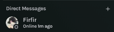

# lastOnline

see how long someone has been offline, as an `online 5m ago` line under their name

## features

- **member list**, **dm list**, **friends list** and **profiles**
- built from presence events, stored locally, forgets anything older than 30 days
- `online <3d ago` when your client was closed for part of that window, because guessing would be rude
- toggleable per surface in settings

## install

if you made it here you probably already know how to install custom plugins, but if not just check [vencord's guide](https://docs.vencord.dev/installing/custom-plugins/)

## heads up

it starts out empty. the only way it learns someone's last online moment is by watching them go offline, so give it a few days before deciding it's broken
